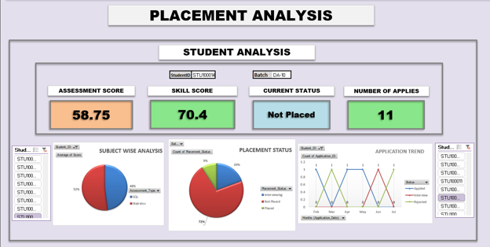
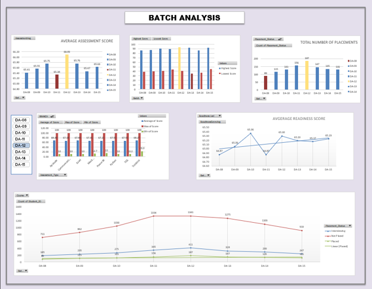
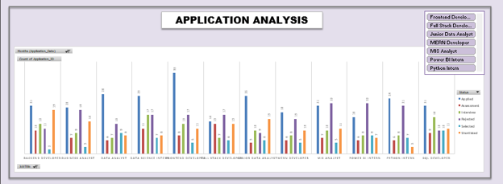
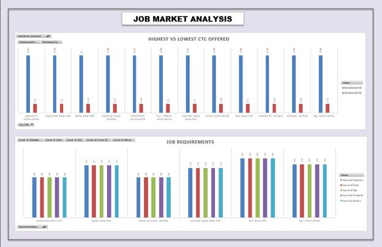

# 📊 Placement Readiness & Skill Gap Analytics

An interactive **Excel-based data analytics project** developed during a hackathon to analyze student performance, placement outcomes, application trends, and job-market requirements.

The project transforms multiple datasets into interactive dashboards that provide insights into **student placement readiness, batch performance, application outcomes, and employer skill requirements**.

---

## 🏆 Hackathon Context

This project was developed as part of a **hackathon**, where the underlying datasets were provided as part of the competition challenge.

The analysis, dashboard development, KPI creation, data interpretation, and skill-gap analysis were performed as part of the project work.

> **Data Attribution:** The underlying dataset was provided for the hackathon and is included in this repository only where permitted by the competition rules.

---

## 🎯 Project Objective

The primary objective was to use data to understand the relationship between **student performance, placement readiness, job applications, and employer requirements**.

The project aims to answer questions such as:

* How prepared are students for placement opportunities?
* How does assessment performance vary across batches?
* What are the application outcomes across different job roles?
* Which skills are most commonly required by employers?
* How do student skills compare with job-market requirements?
* Which areas could benefit from targeted upskilling?

---

## 🛠️ Tools & Skills

### Tools

* Microsoft Excel
* PivotTables
* PivotCharts
* Excel Formulas
* Slicers
* Interactive Dashboards

### Analytical Skills

* Data Analysis
* KPI Development
* Exploratory Data Analysis
* Data Visualization
* Placement Analytics
* Skill Gap Analysis
* Job Market Analysis
* Performance Analysis
* Business Intelligence

---

# 📁 Dataset

The project uses four primary datasets provided for the hackathon.

| Dataset      | Approx. Records | Purpose                                                  |
| ------------ | --------------: | -------------------------------------------------------- |
| Students     |            12K+ | Student profiles, education, experience and skill scores |
| Assessments  |            30K+ | Assessment attempts, scores, results and performance     |
| Jobs         |            12K+ | Job postings, salary ranges and required skills          |
| Applications |            30K+ | Applications, statuses, interview scores and responses   |

These datasets were analyzed together to understand student performance and placement-related outcomes.

---

# 📊 Dashboard & Analysis

The project contains four major analytical views.

---

## 1. Placement Analysis

The **Placement Analysis** dashboard provides a student-level view of placement performance.

It includes:

* Assessment Score
* Skill Score
* Current Placement Status
* Number of Applications
* Subject-wise Assessment Analysis
* Placement Status Distribution
* Application Trends
* Student-level filtering



### What it helps answer

* How is an individual student performing?
* What is the student's current placement status?
* How many jobs has the student applied for?
* How do assessment and skill scores compare?
* What does the student's application activity look like?

---

## 2. Batch Analysis

The **Batch Analysis** dashboard compares student performance and placement outcomes across different batches.

It analyzes:

* Average Assessment Scores
* Highest and Lowest Scores
* Total Placements
* Skill-wise Performance
* Average Readiness Scores
* Placement Status by Batch
* Batch-level trends



### What it helps answer

* Which batches perform better academically?
* How does assessment performance vary across batches?
* Which batches have higher placement outcomes?
* How does readiness change across batches?
* Which skills show stronger or weaker performance?

---

## 3. Application Analysis

The **Application Analysis** dashboard focuses on job applications and their outcomes across different job roles.

It tracks:

* Applications
* Assessments
* Interviews
* Rejections
* Selections
* Shortlisted Candidates
* Job Roles



### What it helps answer

* Which job roles receive the most applications?
* What are the outcomes of student applications?
* Which roles have higher selection activity?
* How do application outcomes differ across job roles?

---

## 4. Job Market Analysis

The **Job Market Analysis** dashboard focuses on employer requirements and compensation.

It analyzes:

* Highest CTC Offered
* Lowest CTC Offered
* Experience Requirements
* Skill Requirements
* Statistics
* Excel
* SQL
* Power BI
* Python



### What it helps answer

* Which job roles offer higher compensation?
* What skills are most commonly required?
* How do skill requirements differ by job role?
* What does the current job market demand from candidates?

---

# 🔍 Skill Gap Analysis

The project also includes a dedicated **Skill Gap analysis** comparing student capabilities with skills demanded by available job opportunities.

The analysis focuses on skills such as:

* Python
* SQL
* Excel
* Power BI
* Statistics

This helps identify areas where students may require additional training to improve their employability and job-match potential.

The detailed skill-gap analysis is available within the Excel workbook.

---

# 💡 Key Business Insights

The analysis can be used to identify:

* Differences in assessment and skill performance across batches.
* Placement readiness patterns among students.
* Application trends across different job roles.
* Selection and rejection patterns.
* Skills commonly demanded by employers.
* Salary differences across job roles.
* Potential gaps between student capabilities and market requirements.

---

# 📈 Business Value

The project demonstrates how placement-related data can support **data-driven decision making** for educational institutions, placement teams, and training providers.

Potential applications include:

1. Identifying students who need additional placement preparation.
2. Monitoring batch-level performance.
3. Understanding application and hiring outcomes.
4. Identifying high-demand technical skills.
5. Designing targeted upskilling programs.
6. Improving student-to-job matching.

---

# 📂 Repository Structure

```text
placement-readiness-skill-gap-analytics/
│
├── README.md
│
├── dashboard/
│   ├── placement_analysis.png
│   ├── batch_analysis.png
│   ├── application_analysis.png
│   └── job_market_analysis.png
│
├── excel/
│   └── Placement_Readiness_Skill_Gap_Analytics.xlsx
│
└── docs/
    └── project_overview.pdf
```

---

# 📘 Excel Workbook Structure

The Excel workbook contains the following sheets:

```text
P1_Students
P1_Assessments
P1_Jobs
P1_Applications
DASHBOARD
Analysis
Skill Gap
PlacementReadiness
```

The `P1_` sheets contain the primary datasets, while the remaining sheets contain analysis, dashboards, skill-gap calculations, and placement-readiness analysis.

---

# 🚀 How to Explore the Project

1. Open the Excel workbook from the `excel` folder.
2. Start with the `DASHBOARD` sheet.
3. Explore the student-level **Placement Analysis**.
4. Review the **Batch Analysis** to compare performance.
5. Explore the **Application Analysis** to understand application outcomes.
6. Review the **Job Market Analysis** to understand employer requirements.
7. Explore the `Skill Gap` and `PlacementReadiness` sheets for detailed analysis.

---

# 📌 Skills Demonstrated

**Excel & BI:**
PivotTables • PivotCharts • Slicers • KPI Dashboards • Data Visualization

**Data Analytics:**
Data Analysis • Performance Analysis • Placement Analytics • Skill Gap Analysis

**Business Analytics:**
Job Market Analysis • Application Analysis • Business Insights • Data-Driven Decision Making

---

## 👨‍💻 Author

**Saif Aqeel**

Data Analytics | SQL | Python | Excel | Business Intelligence

[GitHub](https://github.com/saifAqeel) • [LinkedIn](https://www.linkedin.com/in/saif-aqeel-ab8800223/)
